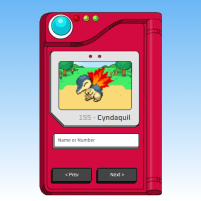
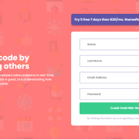

### Meu Site Pessoal
    Feito por mim durante algumas aulas em um curso do youtube com o professor Marco Bruno.
    
Com a medida do tempo fui atualizando, e agora se encontra 100% responsivo.

Adicionado mais algumas atualizações no projeto.

Em breve tera versão em inglês 

### Link
https://oanthonyg.github.io

### Screenshot

                    <a class="items current-item" href="https://oanthonyg.github.io/AfroToDo/"
                        target="_blank">
                        <figure class="card-project">
                            
                        </figure>
                    </a>
                    <a class="items current-item"
                        href="https://oanthonyg.github.io/Projeto-Marvel-MapaDev/" target="_blank">
                        <figure class="card-project">
                            
                        </figure>
                    </a>
                    <a class="items current-item" href="https://anthony-afro-tour.netlify.app"
                        target="_blank">
                        <figure class="card-project">
                            
                        </figure>
                    </a>
                    <a class="items current-item" href="https://oanthonyg.github.io/Alura-Book/"
                        target="_blank">
                        <figure class="card-project">
                            
                        </figure>
                    </a>
                    <a class="items current-item"
                        href="https://oanthonyg.github.io/interactive-rating-component-main/" target="_blank">
                        <figure class="card-project">
                            
                        </figure>
                    </a>
                    <a class="items current-item" href="https://oanthonyg.github.io/Project-Robotron-2000/"
                        target="_blank">
                        <figure class="card-project">
                            
                        </figure>
                    </a>
                    <a class="items current-item" href="https://github.com/oAnthonyG">
                        <figure class="card-project">
                            
                        </figure>
                    </a>
                

                

                    <a class="swiper-slide items current-item" href="https://oanthonyg.github.io/Projeto-Ver-Destino/" target="_blank">
                        <figure class="card-project">
                            
                        </figure>
                    </a>
                    <a class="swiper-slide items current-item" href="https://oanthonyg.github.io/Alura-Midi/" target="_blank">
                        <figure class="card-project">
                            
                        </figure>
                    </a>
                    <a class="swiper-slide items current-item" href="https://oanthonyg.github.io/Projeto-Barbearia_Alura/" target="_blank">
                        <figure class="card-project">
                            
                        </figure>
                    </a>
                    <a class="swiper-slide items current-item" href="https://oanthonyg.github.io/Desafio-2/" target="_blank">
                        <figure class="card-project">
                            
                        </figure>
                    </a>
                    <a class="swiper-slide items current-item" href="https://oanthonyg.github.io/Pokedex/" target="_blank">
                        <figure class="card-project">
                            
                        </figure>
                    </a>
                    <a class="swiper-slide items current-item" href="https://oanthonyg.github.io/Signup-Form-Master/" target="_blank">
                        <figure class="card-project">
                            
                        </figure>
                    </a>
                
